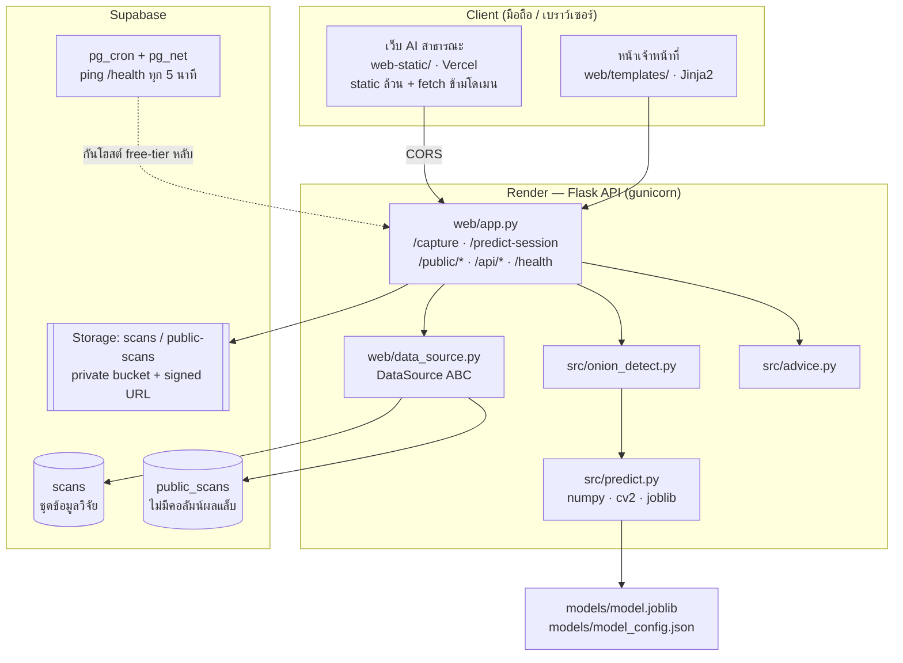
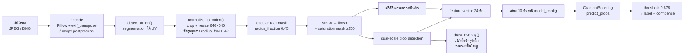
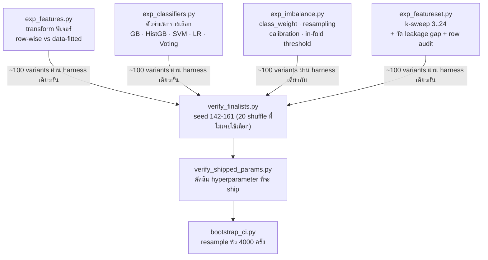
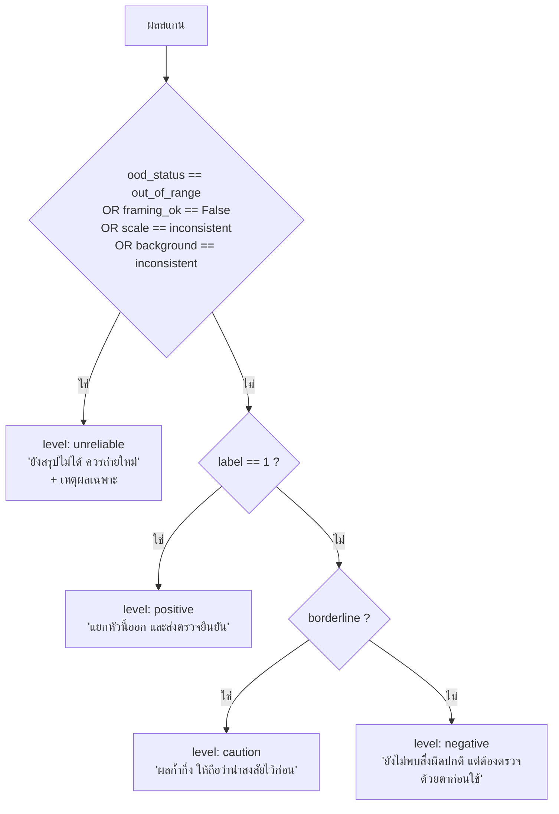
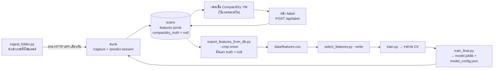

# OnionGuard — ภาพรวมระบบโดยละเอียด (Design → Implementation → Results)

เอกสารนี้อธิบายระบบ **OnionGuard**: ระบบคัดกรอง (screening) ความผิดปกติที่สัมพันธ์กับเชื้อรา
บนหอมแดง จากภาพถ่ายฟลูออเรสเซนซ์ใต้แสง UV 365 nm ด้วยการสกัดฟีเจอร์เชิงภาพ (handcrafted
feature extraction) + ตัวจำแนกแบบ Gradient Boosting และให้บริการผ่านเว็บ

> **ขอบเขตของเอกสารนี้** ครอบคลุมเฉพาะเส้นทางหอมแดง (`crop = onion`) ซึ่งเป็นเส้นทางเดียว
> ที่มีโมเดลที่เทรนแล้ว ส่วนเส้นทางกระเทียมถูกตัดออกตามที่ร้องขอ
>
> **สถานะ ณ ปัจจุบัน** โมเดลที่ deploy อยู่เทรนจากหอมแดงจริง 60 หัว (พบ 35 / ไม่พบ 25)
> ป้ายกำกับ (ground truth) มาจากการเพาะเชื้อ CompactDry YM ทุกหัว

---

## สารบัญ

1. [กรอบปัญหาและข้อตกลงเชิงนิยาม](#1-กรอบปัญหาและข้อตกลงเชิงนิยาม)
2. [สมมติฐานทางฟิสิกส์ที่ระบบตั้งอยู่](#2-สมมติฐานทางฟิสิกส์ที่ระบบตั้งอยู่)
3. [สถาปัตยกรรมระบบ (Deployment Topology)](#3-สถาปัตยกรรมระบบ-deployment-topology)
4. [โปรโตคอลการเก็บภาพ (Acquisition Protocol)](#4-โปรโตคอลการเก็บภาพ-acquisition-protocol)
5. [ไปป์ไลน์ประมวลผลภาพ (Image Processing Pipeline)](#5-ไปป์ไลน์ประมวลผลภาพ-image-processing-pipeline)
6. [เวกเตอร์ฟีเจอร์ (Feature Vector)](#6-เวกเตอร์ฟีเจอร์-feature-vector)
7. [การคัดเลือกฟีเจอร์ (Feature Selection)](#7-การคัดเลือกฟีเจอร์-feature-selection)
8. [โปรโตคอลการประเมินผลกลาง (Evaluation Harness)](#8-โปรโตคอลการประเมินผลกลาง-evaluation-harness)
9. [การเลือกโมเดลและการเทรน](#9-การเลือกโมเดลและการเทรน)
10. [ผลลัพธ์เชิงตัวเลข](#10-ผลลัพธ์เชิงตัวเลข)
11. [ชั้นตรวจสอบความน่าเชื่อถือ (Reliability Gating)](#11-ชั้นตรวจสอบความน่าเชื่อถือ-reliability-gating)
12. [ชั้นข้อมูลและฐานข้อมูล](#12-ชั้นข้อมูลและฐานข้อมูล)
13. [วงจรข้อมูลย้อนกลับ (Data Flywheel)](#13-วงจรข้อมูลย้อนกลับ-data-flywheel)
14. [ความปลอดภัยและ Threat Model](#14-ความปลอดภัยและ-threat-model)
15. [ข้อจำกัดที่ทราบและความไม่สอดคล้องที่ยังค้าง](#15-ข้อจำกัดที่ทราบและความไม่สอดคล้องที่ยังค้าง)
16. [คำสั่งทำซ้ำ (Reproducibility)](#16-คำสั่งทำซ้ำ-reproducibility)
17. [ตารางอ้างอิงไฟล์ต่อหน้าที่](#17-ตารางอ้างอิงไฟล์ต่อหน้าที่)

---

## 1. กรอบปัญหาและข้อตกลงเชิงนิยาม

### 1.1 นิยามงาน

**Binary classification** ระดับ "หัว" (per-head, ไม่ใช่ per-pixel segmentation):

| | ค่า |
|---|---|
| Input | ภาพถ่าย 1 เฟรมใต้ UV 365 nm ต่อ 1 หัว (+ ภาพแสงปกติเป็น optional cross-check) |
| Output | `label ∈ {0, 1}`, `proba_positive ∈ [0,1]`, `confidence`, ธงคุณภาพ, overlay ภาพ |
| Ground truth | ผลเพาะเชื้อ **CompactDry YM** (1 = พบ, 0 = ไม่พบ, `null` = ยังไม่ได้ตรวจ) |
| Unit of analysis | 1 หัว = 1 แถวใน `features.csv` = 1 `sample_code` |

### 1.2 ข้อตกลงเชิงถ้อยคำที่ระบบบังคับใช้ในโค้ด

ระบบนี้ถูกออกแบบให้ **ไม่รับรองความปลอดภัย** และข้อตกลงนี้ถูก hard-code ไว้ในหลายชั้น:

- ป้ายผลบวกคือ **"พบความผิดปกติที่สัมพันธ์กับเชื้อรา"** ไม่ใช่ "พบเชื้อรา" —
  ระบบตรวจ *anomaly ที่ correlate กับเชื้อรา* ไม่ได้ระบุชนิดเชื้อ (`web/app.py: LABEL_TEXT`)
- `null` ในคอลัมน์ `compactdry_truth` แปลว่า **"ยังไม่ได้เพาะเชื้อ"** ไม่ใช่ "ไม่พบเชื้อ"
  (บังคับด้วย `comment on column` ใน `supabase/schema.sql` และ filter ใน `export_features_from_db.py`)
- ข้อความคำแนะนำหลังสแกน (`src/advice.py`) ต้องระบุ **"การกระทำ" (action) ไม่ใช่ "สถานะความปลอดภัย" (status)**
  เพราะ recall ≈ 0.85 แปลว่าพลาดหัวที่มีเชื้อราว 15 ใน 100 หัว — ห้ามใช้คำว่า "ปลอดภัย/กินได้" ในเคส negative
- เคส positive **ไม่แนะนำให้ล้างแล้วใช้ต่อ** เพราะการล้างกำจัดได้เฉพาะสปอร์ที่ผิว
  แต่ mycotoxin ทนความร้อนและการล้าง

---

## 2. สมมติฐานทางฟิสิกส์ที่ระบบตั้งอยู่

| สมมติฐาน | หลักฐาน/ค่าที่วัดได้ | ใช้ที่ไหน |
|---|---|---|
| ใต้ 365 nm พื้นหลังในกล่องเป็น blue-dominant haze แทบไม่มี R/G | วัดได้ B=51, R=7, G=6 | `detect_onion()` — threshold บนแชนเนล R/G |
| หอมแดงเรืองแสงมีองค์ประกอบสีแดง จุดที่เรืองผิดปกติสว่างทุกแชนเนล | — | `detect_onion()`, blob detection |
| เนื้อเยื่อปกติเรืองม่วง/แดง (G ต่ำกว่า R,B) เนื้อเยื่อเสื่อมเรืองขาว (R,G,B ลู่เข้าหากัน) | สมมติฐานตั้งเอง | นิยาม `NDFI` |
| ฟลูออเรสเซนซ์จากเชื้อราจริง **ยังไม่เห็นด้วยตาเปล่า** | premise จากเล่มรายงาน | ฟีเจอร์ `uv_exclusive_dot_frac` |
| กลุ่มจุดเชื้อรา = จุดเล็ก ขอบคม จำนวนมาก, คราบทั่วไป = ปื้นใหญ่ ขอบเบลอ | แยกที่ scale | dual-scale blob detector |
| ในแสงปกติ หอมแดงแยกจากพื้นหลังด้วย **สี** ไม่ใช่ความสว่าง | หอมสูงกว่าพื้นหลังบนแกน a* มัธยฐาน 8.6 SD; เดิมใช้ความสว่างพลาด 32/60 หัว | `detect_onion_visible()` |

---

## 3. สถาปัตยกรรมระบบ (Deployment Topology)



### 3.1 การแยกเป็นสองระบบย่อย

| | เว็บ AI สาธารณะ | หน้าเจ้าหน้าที่ (วิจัย) |
|---|---|---|
| โฮสต์ | `web-static/` บน Vercel (static) | `web/templates/` เสิร์ฟจาก Render |
| endpoint | `/public/capture`, `/public/predict-session`, `/api/public-scans` | `/capture`, `/predict-session`, `/api/scans`, `/api/label` |
| ตาราง | `public_scans` | `scans` |
| bucket | `public-scans` | `scans` |
| รหัสตัวอย่าง | เซิร์ฟเวอร์สร้าง (`P{yymmdd}-{hex6}`) | ผู้ใช้กรอกเอง บังคับกรอก |
| ผลแล็บ | **ไม่มีคอลัมน์** โดยเจตนา | `compactdry_truth` |

**เหตุผลเชิงออกแบบ:** ตาราง `scans` *คือ* ชุดเทรนโดยตรง (`src/export_features_from_db.py`
อ่านจากตารางนี้) ถ้าเว็บสาธารณะเขียนลงตารางเดียวกัน ทุกครั้งที่มีคนกดลองเล่นจะมีแถวขยะปน
เข้าชุดข้อมูลวิจัย — เกิดขึ้นจริงมาแล้ว (แถว `hhh`, `test`, `s002` ตัวพิมพ์เล็ก)

`public_scans` ไม่มีคอลัมน์ `compactdry_truth` **เลย** ไม่ใช่แค่ปล่อยว่าง เพราะการมีช่องนั้นอยู่
จะชวนให้เข้าใจผิดว่าข้อมูลชุดนี้เอาไปเทรนต่อได้

> ⚠️ **นี่คือการแยก DATA ไม่ใช่แยก PERMISSION** — ทั้งสองตารางเขียนผ่าน `service_role` เดียวกัน
> ผู้ที่รู้ URL ฝั่งวิจัยยังยิงเข้าไปได้ ถ้าต้องกันจริงต้องเพิ่ม authentication ซึ่งยังไม่ได้ทำ

### 3.2 เหตุผลที่ inference อยู่ฝั่งเซิร์ฟเวอร์

โมเดลเป็น pickled scikit-learn estimator + OpenCV pipeline ซึ่งรันในเบราว์เซอร์ไม่ได้
มือถือทำหน้าที่เป็น *กล้อง + ตัวอัปโหลด* เท่านั้น ไม่มีการคำนวณฝั่ง client

### 3.3 Cold-start mitigation

Render free tier หลับหลังไม่มี **inbound** traffic ~15 นาที ทำให้ request แรกตอน demo รอ ~50 วินาที
แก้ด้วยสองชั้น:

1. **`supabase/keepalive.sql`** — `pg_cron` + `pg_net` ยิง `GET /health` ทุก 5 นาทีจากภายนอกจริง
2. **`_start_keepalive()`** ใน `web/app.py` — daemon thread self-ping ผ่าน `RENDER_EXTERNAL_URL`
   (no-op เมื่อไม่มี env var นี้ เช่นรันในเครื่อง) — best-effort กลืน exception ทั้งหมด

`/health` จงใจ **ไม่แตะ** โมเดลและฐานข้อมูล เพื่อให้เร็วและไม่ล้มเมื่อ dependency ล่มชั่วคราว

---

## 4. โปรโตคอลการเก็บภาพ (Acquisition Protocol)

กำหนดใน `config.json → capture_sequence.steps` — โค้ดอ่านจาก config ไม่ hard-code

| step | kind | required | หน้าที่ |
|---|---|---|---|
| `V1` | `uv` | ✅ | ภาพหอมแดงใต้ UV 365 nm มุมเดียว → เข้าตัวจำแนก |
| `VISIBLE` | `visible` | ❌ | ถ่ายหัวเดิมซ้ำใต้ไฟห้อง (ห้ามขยับกล้อง/หัวหอม) → cross-check |

**ข้อกำหนดการถ่าย:** มือถือใน Pro/Manual mode **ล็อก ISO / shutter / WB** เพื่อให้ฟีเจอร์
ความสว่างเทียบข้ามหัวได้ รูปแบบไฟล์ที่รับ: `.jpg .jpeg .png .heic .heif .webp .dng` (สูงสุด 60 MB/ไฟล์)

### 4.1 ประวัติการลดจาก 4 มุมเหลือ 1 มุม

โปรโตคอลเดิมคือ 4 มุม + 1 dark frame (ยังเก็บไว้เป็น `_full_protocol_example` ใน config)
เมื่อลดเหลือมุมเดียว ชื่อฟีเจอร์เปลี่ยนตาม: จากคู่ `_viewmean`/`_viewmax` เหลือชื่อเปล่า เพราะ
**ที่มุมเดียวสองค่านี้เท่ากันโดยนิยาม** — คอลัมน์ซ้ำไม่เพิ่มข้อมูล แต่ทำให้ feature importance
ของต้นไม้ถูกหารแบ่งระหว่างสองคอลัมน์ที่เหมือนกัน (`aggregate_views()`)

> การเปลี่ยน `samples.n_views` จึงต้อง **re-extract features + retrain** เสมอ

### 4.2 RAW/DNG — ทำไมจึงเป็น input ที่ดีกว่า

JPEG pipeline ของมือถือใช้ noise reduction ที่ถูกออกแบบมาเพื่อ *ลบจุดสว่างเล็ก ๆ*
ซึ่งเป็นสัญญาณเชื้อราพอดี บวกกับ sharpening/tone-mapping ที่แปรผันรายภาพ
การถอด RAW ข้ามทั้งหมดนั้น (`_load_raw_to_bgr()` ผ่าน `rawpy`)

พารามิเตอร์ postprocess ที่สำคัญ:

| พารามิเตอร์ | ค่า | เหตุผล |
|---|---|---|
| `no_auto_bright` | `true` (**ห้ามเปลี่ยน**) | rawpy จะ rescale ความสว่างรายไฟล์ให้ "ดูสวย" ทำให้หอมสองหัวที่เหมือนกันได้ค่าความสว่างต่างกัน — ทำลายความเทียบเคียงได้ทั้งชุด |
| `use_camera_wb` | `true` | ใช้ WB ที่บันทึกในไฟล์ ซึ่งคงที่เมื่อล็อก Pro mode |
| `output_bps` | `8` | ให้ DNG ลงจอดใน sRGB เดียวกับ path JPEG เพราะโค้ดฟีเจอร์ทำ sRGB gamma decode — ถ้าป้อน linear เข้าไปจะ double-decode |
| `gamma` | `(2.222, 4.5)` | sRGB-ish transfer ให้ตรงกับ path JPEG |

**Fallback:** DNG บางไฟล์ (Lightroom smart preview) ไม่มี Bayer data ให้ demosaic —
ระบบจะถอด embedded JPEG มาใช้แทน **แต่ปฏิเสธถ้าด้านยาว < 1200 px** เพราะ thumbnail
จะให้รายละเอียดน้อยกว่า JPEG มือถือปกติ แต่ยังผลิตตัวเลขที่ "ดูน่าเชื่อ" ออกมา
และจะรายงานที่มาว่าเป็นภาพพรีวิว ไม่ใช่ RAW แท้

---

## 5. ไปป์ไลน์ประมวลผลภาพ (Image Processing Pipeline)



### 5.1 การถอดรหัสภาพและ EXIF orientation

`cv2.imread` **เพิกเฉยต่อ EXIF rotation flag** ภาพ portrait ที่มือถือบันทึกว่า "rotate 90"
จะถูกป้อนเข้าไปตะแคง จึงเปิดผ่าน Pillow แล้วเรียก `ImageOps.exif_transpose()` ก่อนทุกอย่าง
(path RAW ไม่ต้องทำ เพราะ rawpy จัดการ orientation ให้แล้ว)

### 5.2 Segmentation + Geometric Normalization — หัวใจของความถูกต้อง

**ปัญหา:** threshold ขนาด blob (`min_blob_area_px`, `small_area_max_px`, `large_area_min_px`)
เป็น **จำนวนพิกเซลสัมบูรณ์** ถ้าถ่ายใกล้/ไกลต่างกัน "จุดเล็ก" กับ "ปื้นใหญ่" จะหมายถึงคนละขนาดจริง

**ค่าที่วัดได้จริง:**
- ภาพ Android จริงใบแรก: หอมอยู่ที่ frame fraction (0.695, 0.462) แทนที่จะเป็น (0.5, 0.5) →
  31% ของหัวหลุดออกนอก ROI วงกลมคงที่ และ 84% ของ ROI นั้นเป็นพื้นหลังว่าง
- ระหว่างภาพถือมือสองใบ: **ตำแหน่งต่างกัน 28%** ของความกว้างเฟรม, **ขนาดต่างกัน 14%**

**ทางแก้ที่เลือก:** ทำให้สมมติฐานเป็นจริง แทนที่จะผ่อนสมมติฐาน — ตรวจหาวัตถุแล้ว crop + resize
ให้อยู่กลางเฟรมที่ scale คงที่เสมอ หลังจากนั้น ROI คงที่ใน `config.json` ถูกต้องโดยการก่อสร้าง (by construction)
และทุก pixel threshold หมายถึงขนาดจริงเดียวกันในทุกภาพ — ไม่ต้อง plumb per-image ROI ผ่านโค้ดฟีเจอร์

#### `detect_onion()` — โหมด UV

```
bg_mean, bg_std  ← สถิติจากขอบเฟรม (border_frac = 0.06)
thr_R = bg_mean[R] + k·max(bg_std[R], 1.0)      k = detect_k = 4.0
thr_G = bg_mean[G] + k·max(bg_std[G], 1.0)
mask  = (R > thr_R) ∨ (G > thr_G)
```
เป็น adaptive threshold ไม่ใช่ค่าคงที่ จึงปรับตามความสว่างของหลอด UV ในแต่ละวันได้เอง

#### `detect_onion_visible()` — โหมดแสงปกติ

ใช้แกน **a\* ของ CIELAB** (เขียว→แดง) ไม่ใช่ความสว่าง:

```
a      ← cvtColor(BGR2LAB)[:,:,1]
thr_a  = max(bg_a_mean + k·bg_a_std,  bg_a_mean + min_abs_a)
         k = visible_light_detect_k = 4.0 ; min_abs_a = 6.0
```

- **ทำไมเปลี่ยน:** เวอร์ชันแรก threshold บน HSV value ด้วยสมมติฐาน "หอมเป็นสิ่งสว่างที่สุดในเฟรมมืด"
  ซึ่ง**ผิด** — วัดได้ขอบเฟรม gray 52 vs หอม gray 59 บน S001 → พลาด **32 จาก 60 หัว** ทุกครั้ง
  ไปคว้าทั้งเฟรมมาเป็นวัตถุ
- **ทำไม a\* ไม่ใช่ R−B ดิบ:** a\* นิยามให้ **independent จาก lightness** threshold เดียวจึงใช้ได้
  ทั้งห้องสว่างและห้องมืด — สำคัญตรงนี้พอดีเพราะภาพแสงปกติไม่ได้คุม exposure แบบภาพ UV
- **ทำไมต้องมี `min_abs_a` floor:** พื้นหลังกระดาษสาเรียบมาก (std ~1.5) ทำให้ `k·std` เพียงอย่างเดียว
  วางเกณฑ์อยู่ใน noise ของพื้นหลังเอง

#### `_largest_component_to_detection()` — ขั้นตอนร่วม + sanity guard

1. Morphological CLOSE แล้ว OPEN ด้วย kernel ที่ scale ตามขนาดเฟรม (`≈ 0.012·min(h,w)`, odd)
2. `connectedComponentsWithStats(8-connectivity)` → เลือก component พื้นที่มากที่สุด
3. ปฏิเสธถ้าพื้นที่ < `min_area_frac` (0.005 ของเฟรม)
4. CLOSE ซ้ำภายใน component เพื่อเติมรอยพับมืดในหัวหอม (รอยพับก็ยังเป็นหัวหอม)
5. `radius` = ครึ่งหนึ่งของด้านยาวของ bounding box (ให้หางกระดาษอยู่ในกรอบด้วย)
6. **Sanity bounds**: `radius_frac_of_frame` ต้องอยู่ใน [0.15, 0.95] — นอกช่วงแปลว่า segmenter
   ไปคว้าของผิด (เศษฝุ่น หรือพื้นหลังทั้งเฟรม) → รายงาน `ok = False` แล้ว fallback เป็น centred crop
   **พร้อมบอกผู้ใช้** ไม่ใช่เงียบ ๆ วัดผิด
7. รายงาน `touches_edge` ด้านที่ชนขอบภาพ

#### `normalize_to_onion()`

```
half = radius / (2 · onion_radius_frac)          # onion_radius_frac = 0.42
side = 2 · half
crop = img[cy−half : cy+half,  cx−half : cx+half]
out  = resize(crop, 640×640, INTER_AREA ถ้าย่อ / INTER_LINEAR ถ้าขยาย)
```

**Pad ไม่ clamp:** ถ้ากรอบล้นออกนอกภาพจะเติมขอบดำ (`BORDER_CONSTANT`) ไม่ใช่ดันกรอบกลับเข้ามา
เพราะการ clamp จะทำให้หัวหอมเลื่อนออกจากจุดกึ่งกลาง — ลบล้าง normalization ที่ฟังก์ชันนี้มีอยู่เพื่อทำ
คืนธง `padded` และเตือนถ้าพื้นที่ดำ > `warn_pad_area_frac` = 25%

> **Train/serve consistency:** `extract_features.preprocess_image()` เรียกโค้ดชุดเดียวกันนี้
> ตามที่ `feature_extraction.apply_auto_framing = true` บังคับ ถ้าคำนวณฟีเจอร์ตอนเทรนจากภาพดิบ
> จะเกิด train/serve skew — วัดได้บนภาพเดียวกัน `sd_B` 0.023 → 0.036, `texture` 0.030 → 0.023

### 5.3 ROI, Colorimetry, Masking

| ขั้นตอน | รายละเอียด |
|---|---|
| ROI | วงกลม center (0.5, 0.5), `radius_fraction = 0.45` (= 0.42 ของ detector + margin กันขอบหัวโดนตัด) |
| Saturation mask | พิกเซลที่แชนเนลใดก็ตาม ≥ 250 ถูก**คัดออกจากสถิติสี/ความสว่าง/พื้นผิว** เพราะพิกเซล clipped ไม่ได้ถือข้อมูลความสว่างจริง จะ bias mean/SD — **แต่ยังคงอยู่**ในการนับพื้นที่ผิดปกติและ blob detection เพราะพิกเซลที่สว่างจนล้น *คือ* anomaly "สว่างเกิน" ที่ถูกต้อง |
| Gamma decode | `srgb_to_linear()` มาตรฐาน sRGB EOTF: `x ≤ 0.04045 ? x/12.92 : ((x+0.055)/1.055)^2.4` |
| Brightness | `(R+G+B)/3` ใน linear light |
| Luminance (สำหรับ blob) | Rec.709: `0.2126R + 0.7152G + 0.0722B` |

### 5.4 Dual-Scale Masked-Baseline Blob Detection

หัวใจของการแยก **"กลุ่มจุดเชื้อรา" ออกจาก "คราบธรรมดา"** — ทั้งสองต่างกันหลักที่ **scale**
จึงตรวจที่สอง scale แทนที่จะพยายามให้คะแนน "ความคม" ด้วย metric เดียว

```
masked_local_baseline(lum, mask, size) = uniform_filter(lum·mask, size) / max(uniform_filter(mask, size), 1e-6)
```

**ทำไมต้อง normalized (masked) filtering:** ถ้าใช้ uniform filter ธรรมดา พื้นหลังดำนอก ROI
จะดึงค่าเฉลี่ยลงบริเวณใกล้ขอบ ROI ทำให้เกิด **"วงแหวน anomaly ปลอม" รอบขอบ ROI ทั้งวง**

| scale | `filter_size_px` | `anomaly_std_k` | `min_abs_threshold` | จับอะไร |
|---|---|---|---|---|
| **FINE** | 41 | 3.0 | 10 | หน้าต่างใหญ่กว่าจุด แต่เล็กกว่าคราบ → เหลือ high-frequency anomaly (จุด) ส่วนคราบที่ไล่ระดับช้าจะถูกหักล้างเกือบหมด |
| **COARSE** | 181 | 2.2 | 4 | หน้าต่างใหญ่กว่าคราบใหญ่สุด → เหลือการสว่างขึ้นแบบ low-frequency (คราบ/ปื้น) ส่วนจุดเล็กเกินกว่าจะขยับค่าเฉลี่ยหน้าต่างกว้างขนาดนี้ |

```
threshold = max(anomaly_std_k · std(residual ภายใน ROI),  min_abs_threshold)
```

**ลำดับการทำงานและการกันนับซ้ำ:**

1. ตรวจ coarse ก่อน → `large_blobs` (พื้นที่ ≥ `large_area_min_px` = 1200 px)
2. Dilate mask ของ large blob ที่ผ่านตัวกรองแล้ว 6 iterations → `coarse_exclusion`
3. ตรวจ fine โดย **ตัดพื้นที่ `coarse_exclusion` ออก** → `small_blobs`
   (พื้นที่ 12–500 px) เพื่อไม่ให้ texture ภายในคราบถูกนับเป็นจุดเชื้อรา
4. การ exclusion ต้องขับด้วย **mask ของ component ที่ผ่านตัวกรองพื้นที่แล้ว** ไม่ใช่ binary mask ดิบ
   เพราะจุดเล็กที่สว่างมากสามารถดัน threshold coarse ได้โดยไม่ใช่ปื้นจริง

**ความสอดคล้อง scipy ↔ OpenCV:** `src/predict.py` implement ซ้ำด้วย cv2 ล้วน โดยจับคู่ operation
ให้ผลลัพธ์เชิงตัวเลขตรงกับฝั่งเทรน:

| ฝั่งเทรน (`blob_features.py`) | ฝั่ง inference (`predict.py`) |
|---|---|
| `scipy.ndimage.uniform_filter` | `cv2.boxFilter(normalize=True)` |
| `scipy.ndimage.label` | `cv2.connectedComponentsWithStats(connectivity=4)` |
| `scipy.ndimage.binary_dilation` | `cv2.dilate` ด้วย cross kernel (ตรงกับ structure ปริยายของ scipy) |
| `scipy.ndimage.laplace` | `cv2.Laplacian(ksize=1)` (5-point stencil เดียวกัน) |
| `PIL.Image.open` | `cv2.imread` + BGR→RGB |

**Known limitation:** ถ้าจุดในกลุ่มหนาแน่นติดกัน connected-component labeling จะรวมเป็น blob เดียว
แทนที่จะนับแยก — ทางแก้ที่เป็นไปได้คือ watershed split

---

## 6. เวกเตอร์ฟีเจอร์ (Feature Vector)

**24 ฟีเจอร์** = 23 per-view (ที่มุมเดียวจึงเป็น head-level โดยตรง) + 1 cross-modal

### 6.1 กลุ่มสี / ความสว่าง / พื้นผิว (9)

| ฟีเจอร์ | นิยาม |
|---|---|
| `mean_R`, `mean_G`, `mean_B` | ค่าเฉลี่ยแต่ละแชนเนลใน linear light ภายใน `valid_mask` |
| `sd_R`, `sd_G`, `sd_B` | ส่วนเบี่ยงเบนมาตรฐานแต่ละแชนเนล |
| `brightness_mean`, `brightness_sd` | สถิติของ `(R+G+B)/3` |
| `texture` | `std(Laplacian(brightness))` ภายใน mask — ผิวเรียบสุขภาพดี → ค่าต่ำ, ผิวเป็นรู/เสื่อม → ค่าสูง |

### 6.2 กลุ่มพื้นที่ผิดปกติ + ปลายการกระจาย (4)

ใช้ **robust statistics รายหัว** (median + MAD) ไม่ใช่ mean/SD เพราะพิกเซล anomaly เองจะบิด
ค่าประมาณถ้าใช้ mean:

```
med         = median(brightness ภายใน valid_mask)
robust_std  = 1.4826 · MAD
A_high      = fraction( brightness > med + k·robust_std )     k = area_anomaly_mad_k = 3.0
A_low       = fraction( brightness < med − k·robust_std )
F_p95, F_p05 = เปอร์เซ็นไทล์ที่ 95 / 5 ของ brightness
```
> `A_high`/`A_low`/`F_*` คำนวณบน `roi_mask` เต็ม (ไม่ตัด saturated) เพราะพิกเซลที่ล้น *คือ* anomaly สว่างเกิน

### 6.3 NDFI — Normalized Difference Fluorescence Index (3)

```
NDFI = (G − (R+B)/2) / (G + (R+B)/2 + ε)          ε = ndfi_eps = 1e-6
→ NDFI_mean, NDFI_p95, NDFI_p05
```

**สมมติฐาน:** เนื้อเยื่อปกติเรืองม่วง/แดง (G ต่ำกว่า R,B มาก) → NDFI ติดลบชัด;
เนื้อเยื่อเสื่อมเรืองขาว (R,G,B ลู่เข้าหากัน) → NDFI ขยับขึ้นหาศูนย์/บวก

> ⚠️ **นิยามนี้เขียนขึ้นเอง ยังไม่ได้เทียบกับสูตรในเล่มรายงาน** และวัดได้ว่า importance ต่ำกว่ามัธยฐาน
> จึง**ถูกคัดออกจากชุด 10 ฟีเจอร์ที่ใช้จริง** โครงสร้างโค้ดออกแบบให้เปลี่ยนสูตรภายหลังเป็นการแก้ฟังก์ชันเดียว

### 6.4 กลุ่ม blob / cluster (7)

| ฟีเจอร์ | นิยาม |
|---|---|
| `blob_max` | พื้นที่ (px) ของ blob ที่ใหญ่ที่สุด นับรวมทั้ง small และ large |
| `n_small_sharp_blobs` | จำนวนจุดเล็กขอบคม |
| `n_large_blotches` | จำนวนปื้นใหญ่ |
| `avg_small_blob_diam_px` | `mean(2·√(area/π))` ของจุดเล็ก |
| `avg_large_blotch_diam_px` | เช่นเดียวกันสำหรับปื้นใหญ่ |
| `cluster_density` | `1 / (mean nearest-neighbour distance + ε)` ของจุดเล็ก (ต้องมี ≥ 2 จุด ไม่งั้น = 0) |
| `ratio_small_to_large` | `n_small / (n_small + n_large + ε)` — **bounded 0–1 โดยเจตนา** ไม่ใช่อัตราส่วนดิบ `n_small/n_large` ซึ่งจะระเบิดเป็นค่ามหาศาลไร้ความหมายทุกครั้งที่ `n_large = 0` (กรณีที่พบบ่อยในหัวที่มีแต่เชื้อรา) |

### 6.5 ฟีเจอร์ cross-modal (1)

**`uv_exclusive_dot_frac`** — คำนวณ **ครั้งเดียวต่อหัว** (ไม่ใช่ต่อมุม) เพราะเทียบกับภาพ *คนละใบ*

```
discoloration_mask = (hue ∈ [10, 40))  ∧  (sat ≥ 40)  ∧  roi_mask      # HSV แบบ OpenCV
uv_exclusive_dot_frac = 1 − (จำนวนจุดเล็กที่ centroid ตกบน mask / จำนวนจุดเล็กทั้งหมด)
```

- **ตรรกะ:** จุดที่ UV เจอ **แต่ในแสงปกติก็เห็นเป็นคราบ** เป็นหลักฐานที่*อ่อนกว่า*ว่าเป็นฟลูออเรสเซนซ์จริง
  (ตรงตาม premise ของเล่มรายงานว่าฟลูออเรสเซนซ์จากเชื้อราจริงยังไม่เห็นด้วยตาเปล่า)
- **ทิศทาง:** ค่าสูง = จุดส่วนใหญ่อธิบายไม่ได้ด้วยสิ่งที่เห็นในแสงปกติ = คล้ายเชื้อรามากกว่า —
  สอดคล้องกับทุกฟีเจอร์ blob อื่น (สูง = คล้ายเชื้อรามากกว่า)
- **Sentinel `-1.0`** เมื่อไม่มีภาพแสงปกติ **หรือ** detector หาหัวหอมในภาพนั้นไม่เจอ
  (ใช้ fallback crop ต่อจะทำให้ misalign แบบเงียบ ๆ ซึ่งแย่กว่าการบอกว่า "ไม่มีข้อมูล")
  **ไม่ใช่** เมื่อมีศูนย์จุด — กรณีนั้นเป็นข้อมูลจริงและคืน `0.0`
- **การจัดตำแหน่ง (alignment):** ไม่มี explicit registration transform — ทั้งสองภาพถูก normalize
  อิสระผ่าน `normalize_to_onion` ด้วย `onion_radius_frac` เดียวกัน วัดจาก 60 คู่ภาพจริงได้
  มัธยฐานความต่างของรัศมีที่ตรวจได้ **4%** ซึ่งเพียงพอ
- ⚠️ **Calibration caveat:** hue range และ `sat_min` ปรับจากคู่ภาพจริง **เพียงคู่เดียว**
  (ผิวแห้งสีแทนวัดได้ hue 10–40 ครอบคลุม 17% ของผิวในแสงปกติ แต่ 30% ของตำแหน่งจุด UV)
  ถือเป็นจุดตั้งต้น ไม่ใช่ cutoff ที่ validate แล้ว

### 6.6 การคำนวณฟีเจอร์ที่โมเดลปัจจุบันไม่ใช้

`predict.measure_head()` คำนวณ `uv_exclusive_dot_frac` **เสมอ** แม้โมเดลที่ deploy จะไม่ได้ใช้
เพราะ feature dict ของทุกสแกนถูกเก็บลง DB และกลายเป็นข้อมูลเทรนภายหลัง —
ถ้า gate ไว้ตามรายการฟีเจอร์ของโมเดลปัจจุบัน จะเกิด deadlock: ไม่มีโมเดลไหนขอ → ไม่ถูกบันทึก →
ไม่มีข้อมูลให้เทรนโมเดลที่จะขอ

---

## 7. การคัดเลือกฟีเจอร์ (Feature Selection)

**เหตุผล:** 60 หัว ต่อ 24 ฟีเจอร์ = **2.5 หัวต่อฟีเจอร์** ทุกฟีเจอร์ที่เพิ่มคือโอกาสอีกหนึ่งครั้งที่จะเกิด
split ที่ใช้ได้กับ 60 หัวนี้เท่านั้น ผลจาก run ข้อมูลจริงครั้งแรกยืนยันตรงนี้: **specificity 0.56 ที่ SD 0.26 ข้าม fold**

### 7.1 ขั้นที่ 1 — ตัดฟีเจอร์ซ้ำซ้อน (`drop_redundant`, |corr| ≥ 0.95)

| ตัดออก | ซ้ำกับ | corr |
|---|---|---|
| `sd_R` | `mean_R` | 0.958 |
| `brightness_mean` | `mean_B` | 0.995 |
| `brightness_sd` | `sd_B` | 0.993 |
| `F_p95` | `sd_B` | 0.989 |

**24 → 20 ฟีเจอร์เข้าคัดเลือก** — เก็บตัวแรกตามลำดับใน `FEATURE_NAMES` เพื่อให้การเลือก
**ไม่ขึ้นกับ label** สองฟีเจอร์ที่ corr 0.98 จะแบ่ง importance กัน ดันทั้งคู่ลงอันดับ และอาจบัง
ฟีเจอร์ตัวที่สามที่มีประโยชน์จริง

### 7.2 ขั้นที่ 2 — Nested selection ต่อ k

**กับดักที่หลีกเลี่ยง:** จัดอันดับฟีเจอร์บนข้อมูลทั้งชุดแล้วค่อย cross-validate ผู้ชนะ =
**test fold รั่วเข้าสู่การเลือก** และรายงาน accuracy เกินจริงอย่างสม่ำเสมอ

วิธีที่ใช้: **จัดอันดับใหม่ภายในทุก training split** แต่ละ fold เห็นเฉพาะ 48 หัวของตัวเอง เลือก top-k ของตัวเอง
แล้วให้คะแนนบนหัวที่ไม่เคยเห็น (repeats × 5 folds, shuffle fold assignment แล้วเฉลี่ย)

**ชุดฟีเจอร์สุดท้ายเลือกด้วย SELECTION FREQUENCY** — นับว่าฟีเจอร์นั้นติด top-k บ่อยแค่ไหน
ข้ามทุก fold ของทุก repeat — ไม่ใช่ importance บนข้อมูลเต็ม เพราะฟีเจอร์ที่อันดับ 3 ใน fold หนึ่ง
แล้วอันดับ 20 ใน fold ถัดไปคือฟีเจอร์ที่ **ไม่เสถียร** และมีค่าน้อยกว่าฟีเจอร์ที่ติดอันดับ 8 ทุกครั้ง

### 7.3 ขนาดของ selection leakage ที่วัดได้จริง

`reports/experiments/exp_featureset_leakage_gap.csv` วัดช่องว่างระหว่างการจัดอันดับ in-fold (ซื่อสัตย์)
กับการจัดอันดับบนทั้ง 60 หัวแล้วแช่ไว้ (leaky):

| k | kappa in-fold | kappa leaky | **gap** |
|---|---|---|---|
| 6 | 0.421 | 0.531 | +0.109 |
| 8 | 0.456 | 0.562 | +0.106 |
| 9 | 0.486 | 0.566 | +0.080 |
| **10** | **0.500** | **0.553** | **+0.054** |
| 11 | 0.539 | 0.556 | +0.017 |
| 12 | 0.505 | 0.568 | +0.062 |

### 7.4 ชุดฟีเจอร์ 10 ตัวที่ใช้จริง

```
sd_G · avg_small_blob_diam_px · A_high · mean_G · n_small_sharp_blobs
avg_large_blotch_diam_px · ratio_small_to_large · blob_max · texture · sd_B
```

`data/selected_features.json` → `models/model_config.json.feature_names` (ลำดับต้องตรงกัน
เพราะ `predict_head()` สร้าง `X` ตามลำดับนี้)

> ⚠️ **บันทึกความซื่อสัตย์:** ชุด 10 ตัวนี้ถูกสร้างด้วยวิธี leaky (จัดอันดับบนทั้ง 60 หัว)
> `exp_featureset.csv` จึงติดป้ายไว้ตรง ๆ ว่า `"pinned10 fixed (BASELINE, leaky selection)"`
> ตัวเลขผลลัพธ์ในหมวด 10 จึงมี optimistic bias ราว **+0.05 kappa** ตามตารางข้างบน

---

## 8. โปรโตคอลการประเมินผลกลาง (Evaluation Harness)

`src/eval_harness.py` — **สนามทดสอบกลางที่ทุกวิธีต้องผ่านโปรโตคอลเดียวกัน**

**เหตุผลที่ต้องมี:** การเทียบ "วิธี A ได้ 0.77" กับ "วิธี B ได้ 0.81" ไร้ความหมายถ้าสองตัวเลขไม่ได้มาจาก
กระบวนการเดียวกัน ที่ 60 หัว / 12 หัวต่อ test fold **ช่องว่างระหว่างวิธีดีกับวิธีแย่เล็กกว่าช่องว่างระหว่าง
การสุ่มแบ่ง fold สองแบบ** ความต่างเล็ก ๆ ในโปรโตคอล (1 repeat vs 5, threshold 0.5 vs tuned,
จัดอันดับฟีเจอร์ก่อนหรือหลัง split) จะกลบ effect ที่ต้องการวัด

### 8.1 กติกา

| ข้อ | รายละเอียด |
|---|---|
| CV | `StratifiedGroupKFold(n_splits=5)`, group = `sample_code`, ทำซ้ำ `repeats` ครั้งด้วย shuffle ต่างกัน ทุก metric = ค่าเฉลี่ยข้ามทุก fold |
| Contract | วิธีหนึ่ง = `fit_fn(X_train, y_train, seed) → (scorer, threshold)` เห็นเฉพาะ training split |
| Leakage | ทุกอย่างที่ fit บน test split — scaling, feature ranking, threshold, resampling — ถือเป็น leakage วิธีที่ต้อง scale จึงถูกห่อใน `sklearn.Pipeline` เสมอ |
| Threshold | **เป็นส่วนหนึ่งของวิธี** เพราะ accuracy/recall/kappa ขยับตาม threshold ทั้งหมด วิธีที่ชนะเฉพาะที่ threshold ซึ่งเลือกโดยดู test fold ถือว่ายังไม่ชนะ |
| AUC | รายงานคู่กันเสมอ เพราะ threshold-free แยก "จัดอันดับหัวได้ดีกว่า" ออกจาก "เลือกจุดตัดได้ดีกว่า" |
| Metrics | accuracy, recall, specificity, precision, kappa, auc + SD + `fn_total`/`fp_total` |
| BAR | `accuracy ≥ 0.80`, `recall ≥ 0.80`, `kappa ≥ 0.61` |

### 8.2 หมายเหตุเรื่อง `StratifiedGroupKFold`

ปัจจุบันแต่ละแถวใน `features.csv` **เป็น 1 หัวอยู่แล้ว** (มุมถูก aggregate ไปตั้งแต่ขั้นสกัดฟีเจอร์)
ทุก group จึงมี 1 แถว และ `StratifiedGroupKFold` ทำงานเหมือน `StratifiedKFold` ทุกประการ
คงไว้เพื่อให้โค้ด CV ยังถูกต้องฟรี ๆ ถ้าอนาคตกลับไปใช้แถวต่อมุม

---

## 9. การเลือกโมเดลและการเทรน

### 9.1 ลำดับการทดลอง



### 9.2 ทำไมต้องมีขั้น verify แยก (winner's curse)

การทดลองสี่ชุดให้คะแนน ~100 variants บนหอมชุดเดียวกัน ด้วย repeat seed 42–46
**การเลือกที่ดีที่สุดจาก ~100 ตัวบน metric ที่มี fold-to-fold SD ≈ 0.25 คือสูตรของ winner's curse**
ยอดตารางนั้นเป็นทั้งความได้เปรียบจริงและความบังเอิญที่ 5 shuffle นั้นเอื้อ

`verify_finalists.py` จึงรัน finalist ซ้ำบน **seed 142–161** — 20 shuffle ใหม่ของหอม 60 หัวเดิม
ไม่มีอันไหนถูกใช้ตอนคัดเลือก **หัวหอมชุดเดิม** จึงไม่ใช่หลักฐานใหม่เกี่ยวกับหอม
แต่เป็นหลักฐานใหม่ว่าความได้เปรียบของแต่ละ variant มาจากโชคของ fold เท่าไร

### 9.3 ผลการเลือกโมเดล

`reports/experiments/verify_finalists.csv` (100 folds = 5 folds × 20 shuffle):

| วิธี | accuracy | recall | specificity | kappa | AUC | Δkappa เทียบ baseline | ผ่านเกณฑ์ |
|---|---|---|---|---|---|---|---|
| **GradBoost d2** | **0.816** | **0.846** | **0.774** | **0.620** | **0.905** | **+0.081** (t = 4.38) | acc✓ rec✓ kappa✓ |
| GradBoost stumps d1 | 0.816 | 0.883 | 0.722 | 0.614 | 0.908 | +0.075 (t = 3.93) | acc✓ rec✓ kappa✓ |
| GradBoost d2 + cw 0.5 | 0.804 | 0.829 | 0.770 | 0.597 | 0.883 | +0.058 | kappa✗ |
| Vote soft LR+ET+GB | 0.803 | 0.857 | 0.726 | 0.588 | 0.889 | +0.049 | kappa✗ |
| L1 in-fold + RF | 0.797 | 0.867 | 0.700 | 0.575 | 0.880 | +0.036 | acc✗ kappa✗ |
| RF cw pos:neg=0.5:1 | 0.783 | 0.783 | 0.784 | 0.561 | 0.868 | +0.023 | acc✗ rec✗ kappa✗ |
| baseline RF (thr 0.5) | 0.781 | 0.859 | 0.672 | 0.539 | 0.883 | — | acc✗ kappa✗ |

**ผู้ชนะ: `GradientBoostingClassifier(max_depth=2)`**
paired per-fold difference เทียบ baseline RF = **+0.081 kappa** (SD 0.185, SEM 0.0185, **t = 4.38**)
**ชนะ 50 fold / แพ้ 17 / เสมอ 33**

การเปรียบเทียบแบบ paired คือสิ่งเดียวที่ละเอียดพอจะแยก effect จริงออกจากโชคของ fold assignment
เพราะทุก variant ที่เก็บครบ 60 แถวเห็น split ชุดเดียวกันเป๊ะ

### 9.4 การเลือก hyperparameter ที่จะ ship

`verify_shipped_params.py` แก้ข้อขัดแย้ง: inner CV บนข้อมูลเต็ม (ตัดสินด้วย accuracy จาก fit ครั้งเดียว)
เลือก `{d2, n=50, lr=0.2}` ขณะที่ config ที่ผ่านการ verify คือ `{d2, n=100, lr=0.1}`
ตัดสินด้วยการวัดบน seed 142–161 เดียวกัน:

| params | accuracy | recall | kappa | AUC | ผ่านเกณฑ์ |
|---|---|---|---|---|---|
| d2 / 200 / 0.05 | 0.820 | 0.851 | 0.629 | 0.903 | ✓✓✓ |
| innerCV d2 / 50 / 0.2 | 0.818 | 0.854 | 0.624 | 0.903 | ✓✓✓ |
| verified d2 / 100 / 0.1 | 0.816 | 0.846 | 0.620 | 0.905 | ✓✓✓ |
| stumps d1 / 100 / 0.1 | 0.816 | 0.883 | 0.614 | 0.908 | ✓✓✓ |
| **d3 / 100 / 0.1** | 0.792 | 0.820 | **0.570** | 0.861 | acc✗ kappa✗ |

`max_depth=3` ถูก **ลบออกจาก `param_grid`** ถาวร เพราะการทิ้งตัวเลือกที่รู้ว่าแย่กว่าไว้
สร้างช่องให้ retrain ในอนาคตหยิบมันขึ้นมาโดยเงียบ ๆ

### 9.5 การเลือก decision threshold

```
cv_proba   = mean over 20 CV repeats ของ out-of-fold P(positive) ต่อหัว
fpr, tpr, thresholds = roc_curve(y, cv_proba)
threshold  = thresholds[ argmax(tpr − fpr) ]              # Youden's J
→ decision_threshold = 0.6746
```

- **ทำไมไม่ใช้ OOB:** `GradientBoosting` ไม่ bag ต้นไม้ จึงไม่มี `oob_decision_function_`
  แบบ RandomForest จึงใช้ repeated-CV out-of-fold probability แทน ซึ่งทำหน้าที่เดียวกัน:
  ให้ความน่าจะเป็นของแต่ละตัวอย่างจากโมเดลที่ **ไม่เคยเทรนบนตัวอย่างนั้น**
- **ทำไม 20 repeats:** เฉลี่ยหลาย shuffle กัน threshold ไม่ให้ขี่อยู่บน split ที่โชคดีครั้งเดียว
  20 คือจำนวนที่ threshold หยุดขยับ
- **ห้ามเลือกจาก in-sample prediction เด็ดขาด** — จะดูเกือบสมบูรณ์แบบและวางจุดตัดผิดที่

### 9.6 สิ่งที่ `train_final.py` บันทึกออกมา

| ไฟล์ | เนื้อหา |
|---|---|
| `models/model.joblib` | fitted estimator (เทรนบนทั้ง 60 หัว) |
| `models/model_config.json` | `feature_names` (ลำดับสำคัญ), `decision_threshold`, `training_feature_ranges`, `model_type`, `best_params`, `random_seed`, `trained_on_n_samples`, `trained_on_mock` |

แยกจาก `config.json` โดยเจตนา เพื่อให้ปรับ `decision_threshold` ได้โดยแก้ JSON เล็ก ๆ ไฟล์เดียว
ไม่ต้องแตะโค้ดและไม่ต้องแตะพารามิเตอร์ประมวลผลภาพ

**`training_feature_ranges`** = min/max/p05/p95 ของทุกฟีเจอร์ในชุดเทรน บันทึกไว้เพราะ
tree ensemble **extrapolate ไม่ได้** — ค่าที่เกินค่าสูงสุดที่เคยเห็นจะตกลีฟเดียวกับค่าสูงสุดนั้น
ความน่าจะเป็นจึงหยุดตอบสนอง โดยตัวโมเดลเองไม่ส่งสัญญาณอะไรออกมา

---

## 10. ผลลัพธ์เชิงตัวเลข

### 10.1 ตัวเลขที่ควรอ้างอิง (repeated-shuffle, seed ที่ไม่เคยใช้เลือก)

จาก `reports/experiments/verify_finalists.csv` — 5-fold CV × 20 shuffle = 100 folds:

| Metric | ค่า | SD ข้าม fold | เกณฑ์ | ผล |
|---|---|---|---|---|
| **Accuracy** | **0.816** | 0.114 | ≥ 0.80 | ✅ ผ่าน |
| **Recall (sensitivity)** | **0.846** | 0.149 | ≥ 0.80 | ✅ ผ่าน |
| **Cohen's κ** | **0.620** | 0.238 | ≥ 0.61 | ✅ ผ่าน |
| Specificity | 0.774 | 0.202 | — | |
| Precision | 0.854 | 0.118 | — | |
| **AUC** | **0.905** | 0.109 | — | |
| FN รวม / FP รวม | 108 / 113 (จาก 100 folds) | | | |

### 10.2 ความไม่แน่นอน — Bootstrap CI (สำคัญที่สุดในเอกสารนี้)

`src/experiments/bootstrap_ci.py` — สุ่ม **หัวหอม** (ไม่ใช่ fold) ใหม่แบบ with-replacement 4000 ครั้ง

**ทำไมต้อง resample หัว:** การสุ่ม fold ใหม่วัดได้แค่ "โชคของการแบ่ง" แต่คำถามจริงคือ
**"ถ้าเก็บหอมชุดใหม่จากประชากรเดียวกันจะเกิดอะไรขึ้น"**

| Metric | point | 95% CI | เกณฑ์ | **P(ผ่านเกณฑ์)** |
|---|---|---|---|---|
| **kappa** | 0.683 | **0.492 – 0.859** | 0.61 | **78.1%** |
| accuracy | 0.849 | 0.750 – 0.933 | 0.80 | 89.9% |
| recall | 0.885 | 0.771 – 0.973 | 0.80 | 94.0% |
| specificity | 0.799 | 0.632 – 0.947 | — | — |

**การตีความ:** ถ้าเก็บหอมชุดใหม่ 60 หัวจากประชากรเดียวกัน มีโอกาสราว **78%** ที่จะผ่านเกณฑ์ kappa
ช่วงที่กว้างขนาดนี้มาจาก **n = 60 ล้วน ๆ ไม่ใช่จากตัวโมเดล**

> **หมายเหตุเชิงเทคนิค** point estimate ของ bootstrap (κ 0.683) สูงกว่าตัวเลขใน 10.1 (κ 0.620)
> เพราะเป็น estimator คนละตัว: bootstrap เฉลี่ย OOF probability ข้าม 20 repeats **ก่อน**
> แล้วค่อยตัดที่ 0.5 การเฉลี่ยลด variance จึงให้ค่าสูงกว่า **ตัวเลขที่ควรอ้างอิงคือ 0.620**
> ส่วนที่ควรอ่านจาก bootstrap คือ **ความกว้างของ CI** ไม่ใช่จุดกึ่งกลาง

### 10.3 ผลจาก single-shuffle run (`src/train.py`, ตามวิธีในเล่ม)

`reports/phase3_cv_fold_metrics.csv` — 5-fold, shuffle เดียว, seed 42:

| fold | n_train | n_test | accuracy | precision | recall | specificity | f1 | kappa | best_params |
|---|---|---|---|---|---|---|---|---|---|
| 1 | 48 | 12 | 0.833 | 1.000 | 0.714 | 1.000 | 0.833 | 0.676 | d1/100/0.1 |
| 2 | 48 | 12 | 0.833 | 0.778 | 1.000 | 0.600 | 0.875 | 0.636 | d2/100/0.1 |
| 3 | 48 | 12 | 0.833 | 0.857 | 0.857 | 0.800 | 0.857 | 0.657 | d1/100/0.1 |
| 4 | 48 | 12 | 0.750 | 0.700 | 1.000 | 0.400 | 0.824 | 0.438 | d1/100/0.1 |
| 5 | 48 | 12 | 0.667 | 0.714 | 0.714 | 0.600 | 0.714 | 0.314 | d1/100/0.1 |
| **เฉลี่ย** | | | **0.823** | 0.810 | **0.857** | 0.680 | 0.821 | **0.544** | |

**เหตุผลที่ต่างจาก 10.1:** shuffle เดียวที่ 12 หัวต่อ fold แกว่งมาก (kappa 0.314 → 0.676 ระหว่าง fold)
โมเดลตัวเดียวกันได้ 0.544 ที่นี่ และ 0.620 เมื่อเฉลี่ย 20 shuffle **ค่าที่ควรอ้างคือ 0.620**

### 10.4 Confusion matrix (out-of-fold, ทั้ง 60 หัว)

`reports/phase3_oof_predictions.csv` — แต่ละหัวถูกทำนายครั้งเดียวโดยโมเดลที่ไม่เคยเห็นมัน:

| | ทำนาย 0 | ทำนาย 1 |
|---|---|---|
| **จริง 0** (ไม่พบ, n=25) | TN = 17 | FP = 8 |
| **จริง 1** (พบ, n=35) | **FN = 5** | TP = 30 |

→ accuracy 47/60 = 0.783 · recall 30/35 = 0.857 · specificity 17/25 = 0.680 · precision 30/38 = 0.789

### 10.5 Feature importance (เฉลี่ยข้าม 5 fold model)

`reports/phase3_feature_importance.csv`:

| อันดับ | ฟีเจอร์ | mean importance |
|---|---|---|
| 1 | `sd_G` | 0.401 |
| 2 | `A_high` | 0.179 |
| 3 | `avg_small_blob_diam_px` | 0.110 |
| 4 | `n_small_sharp_blobs` | 0.076 |
| 5 | `blob_max` | 0.057 |
| 6 | `sd_B` | 0.056 |
| 7 | `avg_large_blotch_diam_px` | 0.048 |
| 8 | `ratio_small_to_large` | 0.045 |
| 9 | `mean_G` | 0.015 |
| 10 | `texture` | 0.012 |

ฟีเจอร์กลุ่ม blob-cluster (อันดับ 3, 4, 5, 8) ยืนยันสัญญาณเดียวกับ baseline ในเฟส 2

### 10.6 Univariate AUC baseline (เฟส 2)

`reports/phase2_feature_auc_ranking.csv` — AUC ของฟีเจอร์เดี่ยว ๆ:

| ฟีเจอร์ | AUC | ทิศทาง |
|---|---|---|
| `n_small_sharp_blobs` | 0.967 | สูง → พบเชื้อ |
| `ratio_small_to_large` | 0.967 | สูง → พบเชื้อ |
| `avg_small_blob_diam_px` | 0.967 | สูง → พบเชื้อ |
| `cluster_density` | 0.933 | สูง → พบเชื้อ |
| `texture` | 0.860 | สูง → พบเชื้อ |
| `sd_G` | 0.826 | สูง → พบเชื้อ |
| `sd_B` | 0.790 | สูง → พบเชื้อ |

### 10.7 ผลการทดลองด้าน imbalance (สรุป)

`reports/experiments/exp_imbalance.csv` — ตัวที่ผ่านทั้งสามเกณฑ์:

| วิธี | accuracy | recall | specificity | kappa | Δkappa (paired) |
|---|---|---|---|---|---|
| RF class_weight pos:neg = 0.5:1, thr 0.5 | 0.817 | 0.806 | 0.832 | 0.633 | +0.074 (15W/7L) |
| RF + isotonic calibration, thr @ innerCV-kappa | 0.813 | 0.834 | 0.784 | 0.612 | +0.052 (14W/4L) |

ทั้งสองแพ้ GradBoost d2 ในรอบ verify (0.597 และ 0.575 ตามลำดับ) — **การจัดการ imbalance
ไม่ได้ช่วยเท่าการเปลี่ยนตัวจำแนก**

### 10.8 การทดลองด้าน feature transform (สรุป)

`reports/experiments/exp_features.csv` — ทดสอบว่าการทำฟีเจอร์ให้ทนต่อความแปรผันของ exposure ช่วยไหม

**ที่มาของคำถาม:** ฟีเจอร์ที่แรงที่สุดหลายตัว (`sd_G`, `mean_G`, `sd_B`, `texture`) เป็นสถิติ
**ความสว่างสัมบูรณ์** ใน linear light การเปลี่ยน exposure/ระยะจึงคูณทุกตัวด้วย factor ใกล้เคียงกัน
probe ที่วัดได้: การเปลี่ยนความสว่าง ±15% = ~0.35 dataset SD ใน feature space

**ข้อสังเกตเชิงทฤษฎีที่โค้ดระบุไว้:** decision tree แบ่งด้วย `feature ≤ t` การแปลงแบบ
**strictly increasing per-feature** (log1p, per-feature quantile/rank) แค่ map `t → f(t)`
พาร์ทิชันของแถวไม่เปลี่ยน → **RF invariant ทางคณิตศาสตร์** ตัวแปรพวกนี้จึงคาดว่าจะได้ผลเท่า baseline เป๊ะ
ส่วนที่เปลี่ยนได้จริงคือการแปลงที่ **ผสมคอลัมน์** (ratio, per-row standardisation, PCA)

**ผลลัพธ์:** ไม่มี transform ตัวใดผ่านเกณฑ์ kappa ตัวที่ดีที่สุด (`1d ratio/brightness +ref sel10`)
ได้ kappa 0.595 ต่ำกว่าเกณฑ์ 0.61 → **ข้อสรุปเชิงปฏิบัติ: ความเข้มแสงเป็นสัญญาณจริง ไม่ใช่ noise**
จึงคุ้มกว่าที่จะไปทำจิ๊กยึดมือถือ มากกว่าดัดแปลงสูตรฟีเจอร์

### 10.9 Row audit — ข้อมูลเสียกดคะแนนอยู่หรือไม่

`reports/experiments/exp_featureset_row_audit.csv` (robust z-score + MinCovDet distance):

| sample | label | max robust-z | worst feature | MCD distance | framing flagged |
|---|---|---|---|---|---|
| S006 | 0 | 12.73 | `F_p05` | 181.96 | False |
| S011 | 0 | 10.33 | `mean_G` | 949.38 | False |
| ปกติทั่วไป | | 1–4 | | 12–25 | False |

การตัดแถวที่น่าสงสัยออกให้ผลตามนี้:

| variant | n | accuracy | recall | kappa |
|---|---|---|---|---|
| pinned10, ตัด S045 + S011 + S031 | 57 | 0.814 | 0.902 | 0.602 |
| pinned10, ตัด S045 (framing เสีย) | 59 | 0.798 | 0.867 | 0.579 |
| pinned10 ครบ 60 (baseline) | 60 | 0.793 | 0.886 | 0.560 |

การตัดแถวช่วยได้เล็กน้อยแต่ **ไม่พอจะพลิกข้อสรุป** และ **S045 ควรถ่ายใหม่มากกว่าตัดทิ้ง**
(auto-framing พลาด ฟีเจอร์คำนวณจากกรอบกลางภาพ ไม่ใช่หัวหอมจริง)

---

## 11. ชั้นตรวจสอบความน่าเชื่อถือ (Reliability Gating)

ระบบออกแบบให้ **บอกตรง ๆ เมื่อผลไม่น่าเชื่อถือ** แทนที่จะแสดงตัวเลขสวย ๆ เฉย ๆ
มี 5 การตรวจอิสระ + ตัวรวมผลเป็นคำแนะนำ

### 11.1 Out-of-Distribution check (`check_out_of_distribution`)

```
สำหรับทุกฟีเจอร์:
    span   = max − min                                   (จาก training_feature_ranges)
    scale  = max(|max|, |min|, 1e-9)
    ถ้า span ≤ 1e-6  หรือ  span/scale < 1e-3 → ข้าม     # ฟีเจอร์คงที่ในชุดเทรน
    margin = span · tolerance                            tolerance = 0.25
    outlier ถ้า  v > max + margin  หรือ  v < min − margin
```

- **ทำไมสำคัญ:** tree ensemble extrapolate ไม่ได้ ค่าที่เกินไปมากจะตกลีฟเดียวกับค่าสูงสุดที่เคยเห็น
  ความน่าจะเป็นจึงหยุดตอบสนอง **และไม่ส่งสัญญาณใด ๆ ว่า input ผิดปกติ**
- **ไม่ใช่กรณีสมมติ:** ภาพจริงเคยให้ 71 จุด ขณะที่ค่าสูงสุดในชุดเทรนตอนนั้นคือ 18
  (ช่วงที่บันทึกในโมเดลปัจจุบัน: `n_small_sharp_blobs` 1–82)
- **การข้ามฟีเจอร์คงที่:** `span` อาจเป็นเศษ floating-point แทนที่จะเป็นศูนย์จริง
  ทำให้ค่าใดก็ตามที่ต่างออกไปดู "ห่างจากช่วงเป็นอนันต์" — `A_low` เคยทำแบบนี้จริง (0.13–0.13)
- การจัดรูปแบบตัวเลขปรับจำนวนหลักตามความกว้างของช่วง (2/3/4 ตำแหน่ง)
  เพื่อไม่ให้ช่วงแคบจริง ๆ พิมพ์ออกมาเป็นค่าเดียวซ้ำกันจนดูเหมือนบั๊ก

### 11.2 Borderline check

`borderline = (0.5 ≤ proba_positive < decision_threshold)` → ช่วง **[0.500, 0.675)**

โซนนี้คือที่ที่โมเดล *เอนไปทางบวก* แต่ป้ายอ่านว่า *ลบ* และ `confidence` ถูกรายงานเป็น `1 − proba`
ซึ่งดูเหมือน "หลักฐานอ่อน ๆ ว่าสะอาด" ทั้งที่ความจริงตรงข้าม จึงต้องเปิดเผย `proba_positive`
และ `decision_threshold` ดิบออกไปด้วยเสมอ

### 11.3 Framing check

ต่อภาพ รายงานทันทีเพื่อให้ถ่ายใหม่ได้เลย:
- `ok = False` → หาหัวหอมไม่สำเร็จ (พร้อมเหตุผล) ใช้กรอบกลางภาพแทน
- `touches_edge` → หัวหอมชนขอบภาพด้านใด
- `padded` และพื้นที่ดำ > 25% → หัวหอมอยู่ชิดขอบเกินไป

### 11.4 Scale consistency check

เทียบ `radius_frac_of_frame` ข้ามมุม เกณฑ์ `max_radius_spread_across_views = 0.25`
spread เกินเกณฑ์ = ระยะมือถือถึงหัวหอมเปลี่ยนมากระหว่างช็อต หรือมีมุมที่ detection พลาด
→ สถานะ `not_applicable` ในโปรโตคอลมุมเดียว (ระบุตรง ๆ ไม่รายงานเป็น `unknown` ซึ่งจะอ่านเหมือนความผิดพลาด)

### 11.5 Background consistency check (EXIF-free exposure drift)

**ที่มา:** มือถือ Android ที่ทดสอบ (realme 11 5G) **ไม่เขียน ISO/ExposureTime เลย**
EXIF จึงพิสูจน์ไม่ได้ว่า exposure ถูกล็อก พื้นหลังในกล่องเป็นพื้นผิวคงที่ ถ้าความสว่างต่างกัน
ระหว่างมุม แปลว่ากล้อง re-expose

```
bg_level = median( gray[ ~onion_mask ] )      # วัดก่อน re-framing
ratio    = max(bg_level) / min(bg_level)
inconsistent ถ้า ratio > max_ratio = 1.25
unknown ถ้า min(bg_level) < min_level_to_judge = 4.0
```

**ทำไมเป็นอัตราส่วน ไม่ใช่ผลต่าง:** exposure สเกลแบบ **multiplicative** บนพื้นหลังเกือบดำ
(median ~9) การเปลี่ยน exposure 40% ขยับระดับเพียง ~4 counts — threshold แบบสัมบูรณ์
จะปล่อย drift จริงผ่านไปเงียบ ๆ `min_level_to_judge` กัน ratio noise เมื่อพื้นหลังมืดจน
quantization ครอบงำ

### 11.6 EXIF consistency check

เทียบ `ISOSpeedRatings`, `ExposureTime`, `FNumber` ข้ามภาพที่อัปโหลด
ค่าต่างกัน = ไม่ได้ล็อก Pro mode → **เป็นคำเตือน ไม่ block** เพราะ EXIF อาจไม่มี (PNG, metadata ถูกลบ,
บาง HEIC path) และผู้ใช้อาจมีเหตุผลที่ดีที่จะดำเนินการต่อ

### 11.7 การรวมผลเป็นคำแนะนำ (`src/advice.py`)

**ลำดับความสำคัญ: Reliability ชนะ Result เสมอ**



คำแนะนำ `unreliable` ถูกคืน **แทนที่** ไม่ใช่ควบคู่กับ positive/negative — ไม่งั้นหน้าเว็บจะแสดง
คำสั่งที่ฟังดูมั่นใจ ซึ่งได้มาจากตัวเลขที่ระบบเพิ่งบอกเองว่าไร้ความหมาย

เคส `negative` ที่ borderline ถือเป็น **น่าสงสัย ไม่ใช่สะอาด** เพราะ FN แพงกว่าการตรวจซ้ำที่เสียเปล่า
ข้อความทั้งหมด override ได้จาก `config.json → advice.messages` โดยไม่ต้องแตะโค้ด

---

## 12. ชั้นข้อมูลและฐานข้อมูล

### 12.1 DataSource abstraction (`web/data_source.py`)

```
DataSource (ABC)
├── get_samples()          → 1 dict ต่อหัว: sample_code, crop, compactdry, pred_label, pred_proba, features, correct
├── get_dataset_stats(crop) → class counts, balance_ratio, n_images   (นับแยกต่อ crop)
├── get_model_metrics()    → per-fold + mean/SD + confusion + top features
├── get_model_info()       → threshold, n_features, best_params, model_type, seed
└── is_mock_data()         → ธงเตือน banner ทุกหน้า

LocalFileDataSource  ── อ่าน data/*.csv + reports/*
     └── SupabaseDataSource  ── override เฉพาะ scan records
```

**หลักการ:** ทุก method คืน plain dict/list **ไม่เคยคืน DataFrame** เพราะนั่นคือรูปร่างที่ Supabase
client คืนอยู่แล้ว การรักษา contract ให้เป็น database-shaped ตั้งแต่แรกคือสิ่งที่ทำให้การสลับ backend
เป็นงานเชิงกล

**`SupabaseDataSource` extends แทนที่จะ replace โดยเจตนา:** ตาราง scan ต้อง shared และคงทน
แต่ model metrics และรูป ROC/confusion เป็นผลผลิตของ training run ที่อยู่คู่กับโค้ด —
การคัดลอกเข้า DB จะเพิ่มแค่ช่องทางให้สองฝั่งขัดแย้งกันว่าโมเดลไหนถูก deploy อยู่

**Graceful degradation:** `get_data_source()` เลือก Supabase เมื่อมี credential และเชื่อมต่อได้
ไม่งั้น fallback เป็น CSV ท้องถิ่น → พัฒนาได้แบบ offline และ DB ล่มไม่ทำให้ทั้งแอปล่ม

### 12.2 Schema — `public.scans`

| คอลัมน์ | ชนิด | หมายเหตุ |
|---|---|---|
| `id` | `bigint identity` | PK |
| `sample_code` | `text not null` | รหัสที่เจ้าหน้าที่กรอก |
| `crop` | `text not null default 'onion'` | `check (crop in ('onion','garlic'))` |
| `captured_at` | `timestamptz` | |
| `image_path` | `text` | path ใน Storage bucket `scans` |
| `pred_label` | `smallint` | `check in (0,1)` |
| `pred_conf`, `pred_proba` | `real` | `check between 0 and 1` |
| `decision_threshold` | `real` | บันทึก threshold ที่ใช้จริง ณ เวลานั้น |
| **`features`** | **`jsonb`** | ฟีเจอร์ทั้งชุด — **jsonb ไม่ใช่คอลัมน์** เพราะจำนวนฟีเจอร์เปลี่ยนตามการทดลอง (เคย 46 ตอน 4 มุม ตอนนี้ 24) ถ้าเป็นคอลัมน์ต้อง migrate ทุกครั้ง |
| `ood_status` | `text` | `in_range` / `out_of_range` / `unknown` |
| `borderline`, `framing_ok` | `boolean` | |
| `quality_notes` | `jsonb` | ผลการตรวจ scale/background/exif/ood ทั้งหมด |
| **`compactdry_truth`** | `smallint` | **`null` = ยังไม่ได้ตรวจ ไม่ใช่ "ไม่พบเชื้อ"** |
| `truth_recorded_at` | `timestamptz` | |

Index: `sample_code`, `captured_at desc`, `compactdry_truth`, `crop`

**ทำไม `crop` เป็นคอลัมน์ ไม่ใช่ดูจาก prefix ของรหัส:** รหัสตัวอย่างเป็นข้อความที่คนพิมพ์เอง
(เคยมี `hhh`, `s002` ตัวพิมพ์เล็กหลุดเข้ามา) ถ้าให้ชนิดพืชขึ้นกับ prefix ชุดข้อมูลเทรนจะเปลี่ยน
ไปตามคนพิมพ์ผิด — ความผิดพลาดที่เงียบและตามหายาก

**ทำไมเก็บ `features` ไว้:** เทรนซ้ำได้โดยไม่ต้องประมวลผลภาพใหม่ และรับประกันว่าสิ่งที่ DB บอกว่า
ตัวอย่างนี้วัดได้เท่าไร ตรงกับสิ่งที่ training เห็นเป๊ะ

### 12.3 Row Level Security

| Role | สิทธิ์ |
|---|---|
| `anon` (คีย์ในเบราว์เซอร์) | `SELECT` เท่านั้น (policy `"anon can read scans"`) — ไม่มี policy สำหรับ INSERT/UPDATE/DELETE = เขียนไม่ได้ |
| `service_role` (ฝั่งเซิร์ฟเวอร์เท่านั้น) | ข้าม RLS ทั้งหมด ไม่ต้องเขียน policy |

**Storage:** ทั้ง `scans` และ `public-scans` เป็น **private bucket** เว็บดูภาพผ่าน
**signed URL อายุสั้น** ที่เซิร์ฟเวอร์สร้างให้ (`/api/scan-image` → `client.signed_url()` → 302 redirect)
เพราะหน้า label ลิงก์ตรงไปที่ path ไม่ได้ ต้องผ่านเซิร์ฟเวอร์ที่ถือคีย์สำหรับ sign

### 12.4 Supabase REST client (`src/supabase_client.py`)

เขียนตรงกับ PostgREST + Storage HTTP API ด้วย **`urllib` ล้วน ไม่มี dependency เพิ่ม**
เหตุผล: bundle ของ Render/Vercel ใกล้ขีดจำกัดอยู่แล้วด้วย OpenCV + scikit-learn
และเป้าหมาย Raspberry Pi จงใจให้รายการ dependency สั้น

`load_env()` อ่าน `.env` เข้า `os.environ` โดย **environment variable ที่มีอยู่ชนะเสมอ** (`setdefault`)
เพื่อให้ deploy จริง (Render/Vercel) ตั้งค่าได้อย่างถูกต้อง และไฟล์ `.env` ที่หลงเหลือ
ไม่สามารถ override production configuration ได้

---

## 13. วงจรข้อมูลย้อนกลับ (Data Flywheel)



### 13.1 หลักการสำคัญของวงจรนี้

**`export_features_from_db.py` อ่านฟีเจอร์จาก DB โดยตรง ไม่ re-derive จากภาพ**
เพราะทุกแถวเก็บ feature dict ที่ใช้ทำนายจริงไว้แล้ว การคำนวณใหม่จากภาพที่เก็บไว้เสี่ยงต่อ
**silent mismatch** ระหว่างสิ่งที่ DB บอกว่าตัวอย่างวัดได้เท่าไร กับสิ่งที่ training เห็น

**บังคับระบุ `--crop` เสมอ** — หนึ่งไฟล์ `features.csv` = ชุดฝึกของโมเดลเดียว
ถ้าปนสองพืชกัน โมเดลจะเรียนจากพืชผิดชนิดโดยไม่มีอะไรเตือน

**`ingest_folder.py` ขับผ่าน HTTP API ไม่เรียก `predict_head()` ตรง ๆ**
เพราะ path การอัปโหลดจากมือถือทำมากกว่าการทำนาย: EXIF orientation, auto-framing,
quality checks, การบันทึกเฟรม, และการ insert เข้า Supabase ทั้งหมดอยู่ใน `web/app.py`
การ re-implement ส่วนใดส่วนหนึ่งจะสร้าง **pipeline คู่ขนานที่แยกทางกันอย่างเงียบ ๆ**
และจุดประสงค์ทั้งหมดของแถวเหล่านี้คือมันถูกผลิตด้วยวิธีเดียวกับสแกนจริงเป๊ะ

### 13.2 โครงสร้างโฟลเดอร์ที่ `ingest_folder.py` คาดหวัง

```
<root>/S001/UV/<ภาพหนึ่งใบ>
<root>/S001/visible_light/<ภาพหนึ่งใบ>     (optional)
<root>/S002/UV/...
```
ชื่อโฟลเดอร์ = `sample_code` ไม่มีการลบหรือเขียนทับ แต่ละ run เพิ่มแถวใหม่
(`--skip-existing` เพื่อข้ามรหัสที่มีใน DB แล้ว)

---

## 14. ความปลอดภัยและ Threat Model

| ประเด็น | สถานะ | รายละเอียด |
|---|---|---|
| **Authentication** | ❌ **ไม่มี** | หน้าเจ้าหน้าที่ไม่มี login ผู้ที่รู้ URL ยิง `/capture` และ `/api/label` เข้าไปได้ ต้องเพิ่ม auth ถ้าต้องกันจริง |
| **CORS** | `Access-Control-Allow-Origin: *` | ยอมรับได้เพราะแอปไม่ใช้ cookie/credential เลย จึงไม่มีความเสี่ยง session hijack — แค่ให้เบราว์เซอร์อ่าน response ที่เป็นสาธารณะอยู่แล้ว |
| **service_role key** | อ่านจาก environment ฝั่ง **server เท่านั้น** | คีย์นี้ข้าม RLS ทั้งหมด อ่าน/แก้/ลบอะไรก็ได้ **ห้ามส่งให้เบราว์เซอร์** — `anon` key มีไว้เพื่อการนั้นและถูก RLS จำกัดให้ SELECT |
| **Flask debug** | ปิดโดยปริยาย ต้อง opt-in ผ่าน `ONIONGUARD_DEBUG=1` | แอป bind `0.0.0.0` ทั้ง LAN เข้าถึงได้ และ Werkzeug debug console อนุญาต arbitrary code execution บน traceback ใดก็ได้ |
| **Cache poisoning ของคำเตือน** | ป้องกันแล้ว | JavaScript ฝังใน template สำเนาที่ cache ไว้จะรัน logic เก่ากับ API ปัจจุบัน — เคยเกิดจริง: เซิร์ฟเวอร์ส่งคำเตือน out-of-range แต่เบราว์เซอร์แสดงหน้าที่สร้างก่อนคำเตือนนั้นมีอยู่ ผลจึงดูสะอาดทั้งที่ไม่ใช่ → `Cache-Control: no-store` บน HTML/CSS/JS |
| **Upload size** | `MAX_CONTENT_LENGTH = (max_file_mb × n_steps + 10) MB` | fallback 120 MB ถ้าอ่าน config ไม่ได้ |
| **Extension whitelist** | บังคับตาม `allowed_extensions` | |
| **Session TTL** | 30 นาที + `_prune_sessions()` ทุก request | |
| **Dataset/crop lock ต่อ session** | บังคับ | เปลี่ยน dataset หรือ crop กลางคันจะย้ายสแกนเข้าตาราง/ชนิดพืชที่ผิดโดยเงียบ ๆ |
| **`_save_scan()` ไม่เคย raise** | โดยเจตนา | ปัญหา DB/network ต้องไม่ทำให้ผลที่คำนวณเสร็จและอยู่บนจอหายไป — response ส่ง `saved_to_db` กลับเพื่อให้ความล้มเหลว **มองเห็นได้ ไม่ใช่ถูกสันนิษฐาน** |

---

## 15. ข้อจำกัดที่ทราบและความไม่สอดคล้องที่ยังค้าง

### 15.1 ข้อจำกัดเชิงสถิติ (สำคัญที่สุด)

| ข้อจำกัด | ผลกระทบ |
|---|---|
| **n = 60** | สาเหตุ**หลักและเกือบทั้งหมด**ของ CI ที่กว้าง (kappa 0.49–0.86) ไม่ใช่ข้อบกพร่องของโมเดล |
| 2.5 หัวต่อฟีเจอร์ (24 ฟีเจอร์) / 6 หัวต่อฟีเจอร์ (10 ฟีเจอร์) | เสี่ยง overfit สูง เป็นเหตุผลที่ต้องมีขั้นคัดฟีเจอร์ |
| 12 หัวต่อ test fold | SD ของ kappa ข้าม fold ≈ 0.24–0.29 → **ความต่าง 0.03 คือ noise** |
| ชุด 10 ฟีเจอร์สร้างด้วยวิธี leaky | optimistic bias ~+0.05 kappa (วัดได้จาก leakage_gap) |
| กลุ่มลบยังขาด "ตัวยาก" | ต้องมีเปลือกถลอก คราบ ช้ำ เพราะ**ขอบเปลือกฉีกเรืองแสงได้** |
| verify ใช้หอมชุดเดิม | เป็นหลักฐานเรื่อง "โชคของ fold" ไม่ใช่หลักฐานใหม่เกี่ยวกับหอม |

### 15.2 ข้อจำกัดเชิงเทคนิค

- **`NDFI` เป็นนิยามที่เขียนขึ้นเอง** ยังไม่ได้เทียบกับสูตรในเล่มรายงาน (ถูกคัดออกจากชุด 10 ตัวแล้ว)
- **ยังไม่ได้ทำ dark-frame subtraction** — `capture_sequence` รองรับ `kind: "dark"` และจะเก็บ+บันทึกให้
  แต่ `extract_features.py` **ไม่ได้ใช้** การเพิ่ม step เฉย ๆ จะไม่เปลี่ยนผลทำนายใด ๆ
- **iPhone/HEIC ยังไม่รองรับ** ต้องตั้งมือถือให้บันทึก JPEG หรือติดตั้ง `pillow-heif` บนเซิร์ฟเวอร์
- **ฟีเจอร์ความสว่างเป็นค่าสัมบูรณ์** จึงไวต่อ exposure/ระยะ — วัดแล้วว่าเป็นสัญญาณจริง
  (ตัดออกแล้วผลไม่ดีขึ้น) ทางแก้ที่ถูกต้องคือ **ทำจิ๊กยึดมือถือ** ไม่ใช่ดัดสูตร
- **`uv_exclusive_dot_frac` calibrate จากคู่ภาพเดียว** และไม่อยู่ในชุด 10 ฟีเจอร์
- **Blob ที่ติดกันถูกนับรวมเป็นก้อนเดียว** (ยังไม่มี watershed split)
- **`S045` auto-framing พลาด** ฟีเจอร์คำนวณจากกรอบกลางภาพ ไม่ใช่หัวหอมจริง — **ควรถ่ายใหม่**
- **`joblib.load()` ต้องมี scikit-learn** ติดตั้งอยู่ แม้ `predict.py` จะไม่ import โดยตรง
  เป็น transitive dependency ที่เลี่ยงไม่ได้ของ pickled sklearn model

### 15.3 ความไม่สอดคล้องที่ควรจัดการ

| # | ประเด็น | รายละเอียด |
|---|---|---|
| 1 | **hyperparameter ที่ ship ≠ ที่ config ระบุ** | `config.json → train.model.params` = `{d2, n=100, lr=0.1}` แต่ `models/model_config.json → best_params` = `{d2, n=50, lr=0.2}` เพราะ `train_final.py` เรียก `select_hyperparams()` (inner CV) แทนการอ่าน `model.params` โดยตรง — ค่าใน `config.model.params` จึงมีผลเฉพาะที่เรียก `make_model(cfg)` โดยไม่ส่ง `params` **ทั้งสองค่าผ่านเกณฑ์** (κ 0.620 vs 0.624) แต่ควรทำให้ตรงกันเพื่อไม่ให้เลขที่รายงานบรรยายโมเดลที่ไม่เคยถูก deploy |
| 2 | **`data/labels.csv` เป็นของเก่า** | มี 30/30 (ยุค mock) ขณะที่ `data/features.csv` มี 35/25 (ข้อมูลจริง) — `extract_features.py` อ่าน `labels.csv` แต่ pipeline จริงใช้ `export_features_from_db.py` ที่ไม่แตะไฟล์นี้เลย |
| 3 | **เกณฑ์ accuracy/recall/kappa ยังไม่ verify กับเล่มรายงาน** | ตั้งไว้ตั้งแต่เฟส 3 (`0.80/0.80/0.61`) ยังไม่ได้ตรวจว่าตรงกับที่เล่มระบุจริง |
| 4 | **`TABLE_FEATURE_COLUMNS` ยังใช้ชื่อยุค 4 มุม** | `web/data_source.py` อ้าง `_viewmean`/`_viewmax` ซึ่งโมเดลมุมเดียวไม่ได้ผลิต (`_to_float` fallback เป็น 0.0) |
| 5 | **ป้ายกำกับบางกราฟยังเขียน "Random Forest"** | `train.py` plot title/legend ยังคงข้อความเดิมหลังเปลี่ยนเป็น GradientBoosting |

### 15.4 ขั้นตอนถัดไปตามลำดับความสำคัญ

1. **เก็บภาพเพิ่ม** — `n = 60` คือสาเหตุหลักที่ CI กว้าง กลุ่มลบ**ต้องมีตัวยาก**
2. **ทำจิ๊กยึดมือถือ** — วัดแล้วว่าความเข้มแสงเป็นสัญญาณจริง จึงคุ้มกว่าการดัดสูตรฟีเจอร์
3. **ถ่าย S045 ใหม่**
4. **รัน `select_features.py --write` ใหม่ด้วยวิธี in-fold** เพื่อขจัด optimistic bias +0.05 kappa
5. ป้ายกำกับต้องมาจาก **CompactDry YM เท่านั้น** ไม่ใช่จากที่ตาเห็นว่าเรืองแสง

---

## 16. คำสั่งทำซ้ำ (Reproducibility)

```bash
# ---------- ติดตั้ง ----------
python3 -m venv .venv
.venv/bin/pip install -r requirements.txt          # dev เต็มชุด
# requirements-web.txt = ฝั่ง Render (ไม่มี pandas/matplotlib/scipy)
# requirements-pi.txt  = ฝั่ง Raspberry Pi (architecture A: Pi รันทุกอย่างเอง ไม่มี cloud)

# ---------- วงจรข้อมูล ----------
python src/export_features_from_db.py --crop onion            # DB → data/features.csv
python src/export_features_from_db.py --crop onion --exclude S045 --require-framing-ok

# ---------- คัดเลือกฟีเจอร์ ----------
PYTHONPATH=src python src/select_features.py                  # สำรวจ k
PYTHONPATH=src python src/select_features.py --k 10 --write   # แช่ชุดที่เลือก

# ---------- EDA + เทรน ----------
PYTHONPATH=src python src/eda.py                              # เฟส 2: univariate AUC + baseline ROC
PYTHONPATH=src python src/train.py                            # เฟส 3: CV + รายงาน + กราฟ
PYTHONPATH=src python src/train_final.py                      # เฟส 4: error analysis + fit สุดท้าย

# ---------- การทดลอง (ทุกตัวผ่าน eval_harness เดียวกัน) ----------
PYTHONPATH=src python src/experiments/exp_classifiers.py
PYTHONPATH=src python src/experiments/exp_features.py
PYTHONPATH=src python src/experiments/exp_imbalance.py [--repeats N] [--jobs N]
PYTHONPATH=src python src/experiments/exp_featureset.py [--repeats 3 --jobs 4]
PYTHONPATH=src python src/experiments/verify_finalists.py     # seed 142-161
PYTHONPATH=src python src/experiments/verify_shipped_params.py
PYTHONPATH=src python src/experiments/bootstrap_ci.py         # 4000 bootstrap draws

# ---------- รันเว็บ ----------
.venv/bin/python web/app.py                                   # :5000 (debug ปิด)
ONIONGUARD_DEBUG=1 .venv/bin/python web/app.py                # เปิด debug (ระวัง RCE)
gunicorn --pythonpath web --timeout 120 -b 0.0.0.0:$PORT app:app   # โปรดักชัน

# ---------- นำเข้าภาพทั้งโฟลเดอร์ ----------
python web/app.py &                                           # ต้องมี .env ที่มี Supabase credential
python src/ingest_folder.py --root /path/to/photos [--skip-existing]

# ---------- ทำนายเดี่ยวจาก CLI ----------
PYTHONPATH=src python src/predict.py v1.png v2.png v3.png v4.png out_overlay.png
```

**SQL ที่ต้องรันเองใน Supabase Dashboard** (Supabase ไม่เปิด DDL ผ่าน REST API):
`supabase/schema.sql` → `supabase/schema_public.sql` → `supabase/migrations/001_add_crop.sql` → `supabase/keepalive.sql`

**Environment variables:** `SUPABASE_URL`, `SUPABASE_SERVICE_ROLE_KEY`, `SUPABASE_ANON_KEY`
(ตั้งใน Render Dashboard; `render.yaml` ประกาศไว้ด้วย `sync: false` จึงไม่ถูก commit)

---

## 17. ตารางอ้างอิงไฟล์ต่อหน้าที่

### 17.1 การประมวลผลภาพและฟีเจอร์

| ไฟล์ | บรรทัด | หน้าที่ |
|---|---|---|
| `config.json` | — | พารามิเตอร์**ทั้งหมด** — ROI, threshold, ชนิดโมเดล, param_grid, ลำดับการถ่าย, ข้อความคำแนะนำ |
| `src/common.py` | 39 | ROI geometry, `load_config()`, `srgb_to_linear()`, `luminance()` |
| `src/onion_detect.py` | 353 | segmentation (UV / แสงปกติ) + `normalize_to_onion()` |
| `src/blob_features.py` | 200 | dual-scale masked-baseline blob detector (ฝั่ง scipy) |
| `src/extract_features.py` | 287 | `FEATURE_NAMES` (จุดเดียวที่เพิ่ม/ลบฟีเจอร์) → `data/features.csv` |
| `src/visible_features.py` | 75 | cross-modal check → `uv_exclusive_dot_frac` |
| `src/predict.py` | 393 | inference 1 หัว — **numpy/cv2/joblib เท่านั้น** + `draw_overlay()` |

### 17.2 การเทรนและการทดลอง

| ไฟล์ | บรรทัด | หน้าที่ |
|---|---|---|
| `src/eda.py` | 233 | เฟส 2: data quality, univariate AUC, distribution plots, baseline ROC |
| `src/select_features.py` | 197 | `drop_redundant()` + nested selection ตาม selection frequency |
| `src/eval_harness.py` | 158 | **สนามทดสอบกลาง** — `evaluate_method()`, `compare()`, `BAR` |
| `src/train.py` | 405 | เฟส 3: CV + `make_model()` factory + `oof_probabilities()` + กราฟ |
| `src/train_final.py` | 161 | เฟส 4: error analysis จาก OOF + fit สุดท้าย + เขียน `models/` |
| `src/experiments/exp_classifiers.py` | 397 | เทียบตัวจำแนก |
| `src/experiments/exp_features.py` | 502 | เทียบ feature transform (row-wise vs data-fitted) |
| `src/experiments/exp_imbalance.py` | 370 | class weight / resampling / calibration / in-fold threshold |
| `src/experiments/exp_featureset.py` | 481 | k-sweep + วัด leakage gap + row audit (MinCovDet) |
| `src/experiments/verify_finalists.py` | 208 | re-test finalist บน seed 142–161 |
| `src/experiments/verify_shipped_params.py` | 71 | ตัดสิน hyperparameter ที่จะ ship |
| `src/experiments/bootstrap_ci.py` | 106 | bootstrap CI (resample หัว 4000 ครั้ง) |

### 17.3 เว็บ ฐานข้อมูล และ deploy

| ไฟล์ | บรรทัด | หน้าที่ |
|---|---|---|
| `web/app.py` | 1401 | Flask — API + หน้าเจ้าหน้าที่ + quality checks + session management |
| `web/data_source.py` | 317 | `DataSource` ABC + Local/Supabase implementation |
| `web/templates/` | — | `base` · `scan` · `samples` · `dataset` · `model` · `label` (Jinja2) |
| `web-static/` | — | เว็บ AI สาธารณะ (static ล้วน, `config.js` เก็บ `API_BASE`) |
| `src/supabase_client.py` | 195 | PostgREST + Storage client (`urllib` ล้วน) |
| `src/export_features_from_db.py` | 101 | DB → `features.csv` (ตัดแถว `truth = null`, บังคับ `--crop`) |
| `src/ingest_folder.py` | 226 | นำเข้าภาพทั้งโฟลเดอร์ผ่าน HTTP API เดียวกับสแกนจริง |
| `src/advice.py` | 123 | สร้างคำแนะนำ 4 ระดับ (reliability ชนะ result) |
| `supabase/schema.sql` | — | ตาราง `scans` + RLS + bucket |
| `supabase/schema_public.sql` | — | ตาราง `public_scans` (ไม่มีคอลัมน์ผลแล็บ) |
| `supabase/migrations/001_add_crop.sql` | — | เพิ่มคอลัมน์ `crop` + check constraint + index |
| `supabase/keepalive.sql` | — | `pg_cron` + `pg_net` ping `/health` ทุก 5 นาที |
| `render.yaml` | — | Render Blueprint (gunicorn, healthCheckPath, env vars `sync: false`) |

### 17.4 Artifacts ที่ระบบผลิต

| ไฟล์ | เนื้อหา |
|---|---|
| `data/features.csv` | 60 แถว × (24 ฟีเจอร์ + `sample_code` + `compactdry`) |
| `data/selected_features.json` | ชุด 10 ฟีเจอร์ + รายการที่ถูกตัดเพราะ correlation + CV score |
| `models/model.joblib` | fitted `GradientBoostingClassifier` |
| `models/model_config.json` | feature order · threshold 0.675 · training ranges · params · seed |
| `reports/phase2_*` | univariate AUC ranking, distribution plots, baseline ROC |
| `reports/phase3_*` | per-fold metrics, OOF predictions, confusion matrix, ROC, feature importance |
| `reports/feature_selection_by_k.csv` | ผล CV ต่อค่า k |
| `reports/experiments/*.csv` | ผลการทดลอง ~100 variants + verify + bootstrap CI |
| `reports/predict_test_overlays/*.png` | ภาพ overlay ตัวอย่าง (S001–S003) |

---

## ภาคผนวก: ค่าคงที่สำคัญทั้งหมด

| พารามิเตอร์ | ค่า | ที่มา / เหตุผล |
|---|---|---|
| `image.size_px` | 640 | ขนาดเฟรมมาตรฐานหลัง normalize |
| `roi.radius_fraction` | 0.45 | = `onion_radius_frac` 0.42 + margin |
| `onion_detect.onion_radius_frac` | 0.42 | สัดส่วนที่วัตถุครองเฟรมหลัง re-frame |
| `onion_detect.detect_k` | 4.0 | ตัวคูณ std ของพื้นหลังใน UV |
| `onion_detect.min_area_frac` | 0.005 | พื้นที่ขั้นต่ำของวัตถุ |
| `onion_detect.warn_pad_area_frac` | 0.25 | เตือนเมื่อพื้นที่ดำเกินนี้ |
| `sanity.min/max_radius_frac_of_frame` | 0.15 / 0.95 | กันการคว้าเศษฝุ่น / คว้าทั้งเฟรม |
| `sanity.max_radius_spread_across_views` | 0.25 | เกณฑ์ scale consistency |
| `background_consistency.max_ratio` | 1.25 | เกณฑ์ exposure drift (multiplicative) |
| `background_consistency.min_level_to_judge` | 4.0 | ต่ำกว่านี้ ratio เป็น noise |
| `visible_light_detect_k` | 4.0 | ตัวคูณ std บนแกน a* |
| `visible_light_min_abs_a` | 6.0 | floor หน่วย a* กันพื้นหลังเรียบเกินไป |
| `blob.fine_filter_size_px` | 41 | > จุด, < คราบ |
| `blob.coarse_filter_size_px` | 181 | > คราบใหญ่สุด |
| `blob.anomaly_std_k_fine / coarse` | 3.0 / 2.2 | |
| `blob.min_abs_threshold_fine / coarse` | 10 / 4 | |
| `blob.coarse_exclusion_dilate_px` | 6 | กันนับ texture ในคราบเป็นจุดเชื้อ |
| `blob.min_blob_area_px` | 12 | |
| `blob.small_area_max_px` | 500 | |
| `blob.large_area_min_px` | 1200 | |
| `feature_extraction.saturation_threshold` | 250 | |
| `feature_extraction.area_anomaly_mad_k` | 3.0 | |
| `visible_features.discoloration_hue_range` | [10, 40) | OpenCV hue; ผิวแห้งสีแทน |
| `visible_features.discoloration_sat_min` | 40 | |
| `visible_features.sentinel_no_visible` | −1.0 | |
| `train.outer_n_splits / inner_n_splits` | 5 / 4 | |
| `train.threshold_cv_repeats` | 20 | จำนวนที่ threshold หยุดขยับ |
| `train.accuracy_min / recall_min / kappa_min` | 0.80 / 0.80 / 0.61 | เกณฑ์ผ่าน |
| `random_seed` | 42 (verify ใช้ 142–161) | |
| **`decision_threshold`** | **0.6746** | Youden's J บน OOF probability |
| OOD `tolerance` | 0.25 | เศษส่วนของช่วงที่ยังยอมรับ |
| `SESSION_TTL_SECONDS` | 1800 | |
| `upload.max_file_mb` | 60 | |
| `KEEPALIVE_INTERVAL_SECONDS` | 600 (in-app) / 300 (pg_cron) | |

---

*เอกสารนี้สร้างจากการอ่านซอร์สโค้ดและไฟล์ผลลัพธ์ในรีโป ณ commit `c29d050`
ตัวเลขทุกตัวอ้างอิงไฟล์ใน `reports/` โดยตรง*
